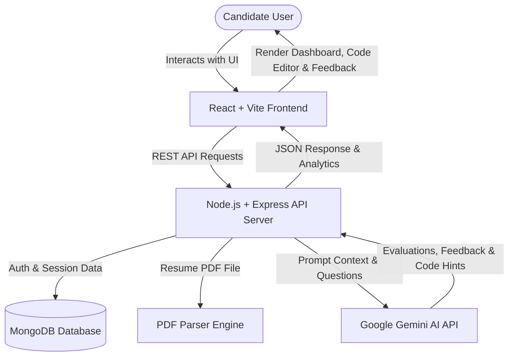

# 🚀 Interview Prep AI

<div align="center">

  

  **Next-Generation AI-Powered Mock Interview & Candidate Skill Evaluation Platform**

  [](https://reactjs.org/)
  [](https://vitejs.dev/)
  [](https://nodejs.org/)
  [](https://expressjs.com/)
  [](https://www.mongodb.com/)
  [](https://deepmind.google/technologies/gemini/)
  [](https://tailwindcss.com/)
  [](LICENSE)

  [Demo](#-getting-started) • [Features](#-key-features) • [Tech Stack](#%EF%B8%8F-tech-stack) • [Architecture](#-architecture--workflow) • [API Specs](#-api-endpoints) • [Deployment](#-deployment)

</div>

---

## 📌 Overview

**Interview Prep AI** is a comprehensive, full-stack web application designed to help job seekers master technical and behavioral interviews. Powered by **Google Gemini AI**, the platform offers personalized interview simulations, real-time code evaluation in an embedded IDE, automated resume parsing for question customization, and collaborative peer mock interview rooms.

Whether you're preparing for Frontend, Backend, Full-Stack, System Design, or Behavioral interviews, **Interview Prep AI** acts as your personal 24/7 AI career coach.

---

## ✨ Key Features

### 🤖 1. AI-Driven Mock Interviews
- **Adaptive Questioning**: Dynamic technical, behavioral, and system design questions tailored to your chosen role, experience level, and domain.
- **Real-Time Evaluation**: AI evaluates your answers on technical accuracy, clarity, problem-solving structure, and communication depth.
- **Actionable Feedback**: Instant breakdown of strengths, weaknesses, and model answers after every session.

### 📄 2. Smart Resume Parsing & Tailoring
- **PDF Resume Upload**: Parses resume files (`pdf-parse`) to automatically extract skills, projects, and work history.
- **Custom Interview Tracks**: Generates hyper-specific interview questions based directly on your resume background.

### 💻 3. Interactive Coding Lab
- **Monaco Editor Integration**: Embedded VS Code-grade code editor powered by `@monaco-editor/react`.
- **Multi-Language Support**: Write and test code in JavaScript, Python, C++, Java, and more.
- **AI Code Review & Hints**: Get instant AI feedback on code complexity ($O(n)$ time/space complexity), edge cases, and optimizations.

### 👥 4. Collaborative Peer Mock Rooms
- **Practice Rooms**: Join or host mock interview rooms with peers to simulate live human interview conditions.
- **Shared Coding Workspace**: Collaborative problem-solving environment for peer practice.

### 📊 5. Performance Dashboard & Analytics
- **Session Progress Tracking**: Track score improvements over time across different interview categories.
- **Detailed Scorecard**: Categorized breakdowns (Technical Depth, Problem Solving, Communication, Code Quality).

### 🔐 6. Secure Authentication & Security
- **JWT & Password Hashing**: Robust User Authentication using JSON Web Tokens (JWT) and `bcryptjs`.
- **Protected Routes & API Security**: Secure endpoints with middleware authorization and CORS configuration.

---

## 🛠️ Tech Stack

### **Frontend**
| Technology | Description |
| :--- | :--- |
| **React 18** | Modern UI development with Hooks & Context API |
| **Vite** | Lightning-fast frontend build tooling |
| **Tailwind CSS** | Utility-first styling with sleek glassmorphism themes |
| **Monaco Editor** | Embedded VS Code browser editor (`@monaco-editor/react`) |
| **React Router v7** | Seamless client-side single page routing |
| **Lucide React** | Clean, modern iconography |
| **Axios** | HTTP client for backend REST API calls |

### **Backend**
| Technology | Description |
| :--- | :--- |
| **Node.js** | Scalable asynchronous JavaScript runtime |
| **Express.js** | Fast, minimalist backend framework |
| **MongoDB & Mongoose** | NoSQL database for users, sessions, rooms, and metrics |
| **JSON Web Tokens (JWT)** | Token-based secure user authentication |
| **Multer & PDF-Parse** | File upload handling and PDF text extraction |

### **AI Engine**
| Technology | Description |
| :--- | :--- |
| **Google Gemini API** | Advanced LLM engine (`@google/generative-ai`) for real-time question generation, code analysis, and session evaluation |

---

## 📐 Architecture & Workflow



---

## 📁 Repository Structure

```
Final_Interview_prep/
├── client/                     # React + Vite Frontend
│   ├── public/                 # Static public assets
│   ├── src/
│   │   ├── assets/             # Images, graphics, icons
│   │   ├── components/         # Reusable UI components (Navbar, Modal, Cards)
│   │   ├── context/            # Auth & Application Context state
│   │   ├── data/               # Static mock data & topic guides
│   │   ├── hooks/              # Custom React hooks
│   │   ├── layouts/            # Page layouts (Dashboard Layout, Auth Layout)
│   │   ├── pages/              # Main view pages (Dashboard, Coding Lab, Sessions)
│   │   ├── services/           # Axios API services
│   │   ├── utils/              # Helper functions & formatting logic
│   │   ├── App.jsx             # Main Router configuration
│   │   └── main.jsx            # React root entry point
│   ├── package.json
│   ├── tailwind.config.js
│   └── vite.config.js
│
├── server/                     # Node.js + Express Backend Server
│   ├── src/
│   │   ├── config/             # DB & Environment configs
│   │   ├── controllers/        # Route controllers (Auth, Sessions, Coding, Rooms)
│   │   ├── lib/                # Utility helpers & external clients
│   │   ├── middleware/         # Auth JWT verification & error handling
│   │   ├── models/             # Mongoose Schemas (User, Session, MockRoom, Resource)
│   │   ├── routes/             # Express API routes
│   │   ├── services/           # Gemini AI & Resume Parsing services
│   │   ├── app.js              # Express app middleware setup
│   │   └── index.js            # Server entry point
│   ├── .env.example
│   └── package.json
│
├── vercel.json                 # Vercel deployment configuration
├── package.json                # Root NPM Workspaces package file
└── README.md                   # Project Documentation
```

---

## ⚡ Getting Started

### Prerequisites

Ensure you have the following installed on your local development machine:
- **Node.js**: `v18.x` or higher ([Download Node.js](https://nodejs.org/))
- **npm**: `v9.x` or higher (comes with Node.js)
- **MongoDB**: A running MongoDB instance locally or a free [MongoDB Atlas Cluster](https://www.mongodb.com/cloud/atlas)
- **Google Gemini API Key**: Obtain a free API key from [Google AI Studio](https://aistudio.google.com/)

---

### 📥 Installation & Setup

1. **Clone the Repository**
   ```bash
   git clone https://github.com/Priyanshu6926/Interview-Prep-AI.git
   cd Interview-Prep-AI
   ```

2. **Install Workspace Dependencies**
   ```bash
   npm install
   ```
   *This installs dependencies for both `client` and `server` via NPM workspaces.*

3. **Configure Environment Variables**

   **Backend Setup (`server/.env`)**
   Create a `.env` file in the `server` directory based on `server/.env.example`:
   ```bash
   cp server/.env.example server/.env
   ```
   Fill in your environment parameters in `server/.env`:
   ```env
   PORT=5000
   NODE_ENV=development
   MONGODB_URI=mongodb+srv://<username>:<password>@cluster.mongodb.net/interview-prep-ai
   JWT_SECRET=your_super_secret_jwt_key_here
   GEMINI_API_KEY=your_google_gemini_api_key_here
   ```

   **Frontend Setup (`client/.env`)**
   Create a `.env` file in the `client` directory:
   ```env
   VITE_API_BASE_URL=http://localhost:5000/api
   ```

---

### 🏃 Running the Application

You can start the frontend and backend servers using workspace npm scripts:

- **Run Server (Backend)**
  ```bash
  npm run dev:server
  ```
  *Server runs at `http://localhost:5000`*

- **Run Client (Frontend)**
  ```bash
  npm run dev:client
  ```
  *Client app runs at `http://localhost:5173`*

- **Run Both Simultaneously**
  Open two terminal instances or use concurrent execution to run `npm run dev:server` and `npm run dev:client`.

---

## 🔌 API Endpoints Summary

| Module | Method | Endpoint | Description | Auth Required |
| :--- | :--- | :--- | :--- | :---: |
| **Auth** | `POST` | `/api/auth/register` | Register a new user | ❌ |
| **Auth** | `POST` | `/api/auth/login` | Authenticate user & receive JWT | ❌ |
| **Auth** | `GET` | `/api/auth/me` | Fetch authenticated user profile | 🔒 |
| **Sessions**| `POST` | `/api/sessions/create` | Initialize AI interview session | 🔒 |
| **Sessions**| `GET` | `/api/sessions/:id` | Get interview session details | 🔒 |
| **Sessions**| `POST` | `/api/sessions/:id/submit` | Submit response for AI evaluation | 🔒 |
| **Resume** | `POST` | `/api/sessions/upload-resume` | Upload & parse PDF resume | 🔒 |
| **Coding** | `POST` | `/api/coding/evaluate` | Evaluate code in Monaco Editor via Gemini | 🔒 |
| **Rooms** | `GET` | `/api/mock-rooms` | List public peer mock rooms | 🔒 |
| **Rooms** | `POST` | `/api/mock-rooms` | Create a new mock room | 🔒 |

---

## 🌐 Deployment

### Frontend Deployment (Vercel)
The project includes a ready-to-use `vercel.json` file.
1. Import your GitHub repository to [Vercel](https://vercel.com).
2. Set the Root Directory to `client`.
3. Add Environment Variable:
   - `VITE_API_BASE_URL`: Your deployed backend URL (e.g., `https://your-api.onrender.com/api`).
4. Click **Deploy**.

### Backend Deployment (Render / Railway)
1. Deploy the `server` directory as a Web Service on [Render](https://render.com) or [Railway](https://railway.app).
2. Build Command: `npm install`
3. Start Command: `npm start`
4. Add Environment Variables: `PORT`, `MONGODB_URI`, `JWT_SECRET`, `GEMINI_API_KEY`, `NODE_ENV`.

---

## 🤝 Contributing

Contributions are what make the open-source community an incredible place to learn, inspire, and create. Any contributions you make are **greatly appreciated**!

1. Fork the Project
2. Create your Feature Branch (`git checkout -b feature/AmazingFeature`)
3. Commit your Changes (`git commit -m 'Add some AmazingFeature'`)
4. Push to the Branch (`git push origin feature/AmazingFeature`)
5. Open a Pull Request

---

## 📄 License

Distributed under the MIT License. See [`LICENSE`](LICENSE) for more information.

---

<div align="center">
  <sub>Built with ❤️ by <a href="https://github.com/Priyanshu6926">Priyanshu</a> using React, Node.js, Express & Google Gemini AI.</sub>
</div>
